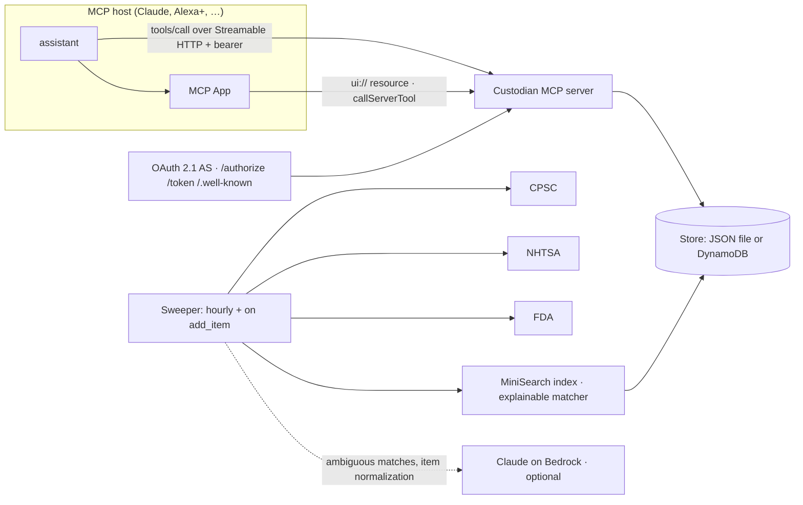

# Custodian

**A household inventory that keeps watch.**

Tell it what you own — a car seat, a stroller, the minivan, the smoke detectors — and Custodian continuously cross-references the public **CPSC**, **NHTSA** and **FDA** recall feeds, explains in plain language what is wrong and what the manufacturer will do about it, and keeps track of the small things that keep a home safe: smoke-detector batteries, water and air filters, car-seat expiry, vehicle service, warranties.

It is delivered as a **self-hosted [MCP](https://modelcontextprotocol.io) server**, so it works from any MCP host — Claude, an Echo Show running Alexa+, or a script — and it ships with an **MCP App** so hosts with a screen can show the recall notice, the affected models and a one-tap "I've handled it".

[](https://github.com/happyc0der/custodian/actions/workflows/ci.yml)


<p align="center">
  
</p>

```
"I just bought a Graco 4Ever car seat."
  → Got it, I've added Graco 4Ever car seat as a car seat. I'll keep an eye on recalls and let you know if anything comes up.

"Is anything in my house recalled?"
  → Your Joolz Aer2 car seat adapter is affected by a recall: the adapters can fail to attach to the stroller,
    which may allow the car seat to fall. The maker is offering a refund. There is one more on screen.

"Anything I should know about?"
  → Heads up: there's a new recall on your 2019 Honda Odyssey … Also, your Kidde smoke detector needs
    new batteries, 71 days overdue, and your Graco 4Ever car seat expires in 19 days.
```

## Why it's interesting

Recall remedy rates are poor because the notice reaches the wrong place at the wrong time — an email from a brand you forgot you bought from. The assistant that is _in the room_ when you strap a car seat in is the one that should know. Custodian was built as an Alexa+ add-on, and the constraints of that platform shaped it into a fairly clean case study in building a production-shaped MCP server:

- **Voice-first tool design.** Every tool returns one or two spoken sentences (no URLs, no ids) in `content` and the full payload in `structuredContent` under a declared `outputSchema`. Ambiguity is resolved by _returning candidates_ rather than by elicitation, because assistant clients cannot be assumed to support it.
- **A hard latency budget.** Alexa+ allows 500 ms per tool call, so no tool handler touches the network or a model. All I/O lives in a background sweeper (hourly, and immediately after an item is added); tools read a local store and answer in single-digit milliseconds. `/metrics.json` reports p50/p95 per tool.
- **OAuth 2.1 in the shape assistants actually need.** Two tiers — `client_credentials` for discovery, `authorization_code` + PKCE bound to a household for tool calls — with rotating refresh tokens, the `resource` parameter, multiple registered redirect URIs, no dynamic registration and no `WWW-Authenticate` challenge. Generic MCP auth libraries don't emit that shape, so it is a small self-contained authorization server, plus a conformance script that checks every property.
- **Explainable matching over messy public data.** Deterministic scoring (brand, model, descriptive-word overlap, category gate, vehicle exactness, purchase-date recency) with a written `reason` on every match. A Claude-on-Bedrock adjudicator is optional and only consulted in the ambiguous band; its verdict is cached. The feeds are imperfect — a CPSC record that carries another recall's title, null-y NHTSA rows — and the normalizers are hardened accordingly ([docs/platform-notes.md](docs/platform-notes.md)).
- **One MCP App, five views.** A single content-hashed Preact bundle (~70 KB gzipped) renders recall cards, a detail page, inventory, a maintenance timeline and a briefing, picking the view from the calling tool. Host theme and style variables, safe-area insets, inline/fullscreen modes, and a CSP limited to the recall feeds' image hosts. On-screen actions call tools and push what the user did into the model's context.

<p align="center">
  
  
</p>

_Rendered with the reference [MCP Apps basic-host](https://github.com/modelcontextprotocol/ext-apps/tree/main/examples/basic-host) against live recall data._

## Tools

| Tool                             | Say                                                        | Does                                                                                         |
| -------------------------------- | ---------------------------------------------------------- | -------------------------------------------------------------------------------------------- |
| `add_item`                       | "I just bought a …", "we have a 2019 Honda Odyssey"        | Records the item, infers brand/category, schedules a targeted recall sweep _after_ answering |
| `check_recalls`                  | "is my car seat recalled?", "any recalls?"                 | Precomputed recall matches with severity and plain-language remedy · screen: recall cards    |
| `get_recall_details`             | "tell me more", "who do I call?"                           | Full notice, affected models, contact · screen: detail view                                  |
| `acknowledge_recall`             | "I requested the refund"                                   | Closes the match (also a button on screen)                                                   |
| `household_briefing`             | "anything I should know?"                                  | New recalls + due maintenance since last time · screen: briefing                             |
| `whats_due`                      | "what needs doing at home?"                                | Overdue / upcoming maintenance · screen: timeline                                            |
| `log_maintenance`                | "I changed the smoke detector batteries"                   | Rolls the reminder forward                                                                   |
| `set_maintenance_reminder`       | "remind me to descale the espresso machine every 3 months" | Custom reminders                                                                             |
| `list_inventory` / `remove_item` | "what are you tracking?", "we sold the stroller"           | Inventory management · screen: inventory                                                     |

## Architecture



```
packages/shared    zod schemas shared by server and UI (entities + tool output schemas)
packages/server    MCP server, OAuth 2.1 AS, recall sources, matcher, sweeper, stores
packages/ui        MCP App (Preact) → dist/app.html
infra              AWS CDK: App Runner + DynamoDB + Secrets Manager + Bedrock IAM
scripts            smoke, oauth-conformance, seed, gen-assets, dev-proxy, setup.sh
addon-package      Alexa+ add-on manifest
docs               platform notes
```

## Run it

```bash
npm install
npm run build:ui              # builds the MCP App bundle
cp .env.example .env          # AUTH_MODE=dev, JSON file store
npm run dev                   # http://localhost:3001/mcp
```

```bash
npm run seed                  # a realistic inventory; real recalls appear within seconds
npm run smoke                 # a scripted, voice-shaped conversation with latency numbers
npm run oauth:conformance     # the account-linking checks against a running server
npm run check                 # typecheck · lint · format · tests · UI build
```

Connect a host:

- **Claude Desktop / claude.ai** — `npx cloudflared tunnel --url http://localhost:3001`, then add `<tunnel>/mcp` as a custom connector. It walks the OAuth flow; the login page creates your household on first use.
- **MCP Apps basic-host** (renders the screens) — `npx tsx scripts/dev-proxy.ts`, then in [ext-apps/examples/basic-host](https://github.com/modelcontextprotocol/ext-apps/tree/main/examples/basic-host): `SERVERS='["http://localhost:3099/mcp"]' npm start`.
- **Alexa+** — see [addon-package/README.md](addon-package/README.md) (requires the Alexa+ MCP Toolkit).

### Deploy to AWS

```bash
npm run infra:deploy                                  # App Runner + DynamoDB + secret; prints ServiceUrl
npm run infra:deploy -- -c publicUrl=https://<ServiceUrl> -c redirectUris=<comma-separated redirect URIs>
```

The second deploy pins `PUBLIC_URL` (OAuth issuer and JWT audience) once the App Runner domain exists. Bedrock enrichment is on in that stack (`anthropic.claude-opus-5` via the Messages-API endpoint) and off locally by default.

## Testing

`npm test` runs the suite against recorded fixtures from the live feeds: source normalizers, the matcher's precision cases (including the mis-titled CPSC record), the sweeper with fake sources, the OAuth server end to end, every tool through the real HTTP stack, the MCP Apps wiring, and the `Store` contract against both the file store and DynamoDB (via [dynalite](https://github.com/architect/dynalite)). CI runs typecheck, lint, format, tests, the UI build and a CDK synth on every push.

## Data sources

Public, keyless, and attributed on every match: [CPSC recalls](https://www.saferproducts.gov/RestWebServices/Recall?format=json), [NHTSA recalls](https://api.nhtsa.gov/) (vehicle campaigns and the child-seat catalogue), and [openFDA enforcement reports](https://open.fda.gov/apis/) for food, drugs and devices. Recall information can be delayed or incomplete; always confirm with the manufacturer or the issuing agency before acting.
