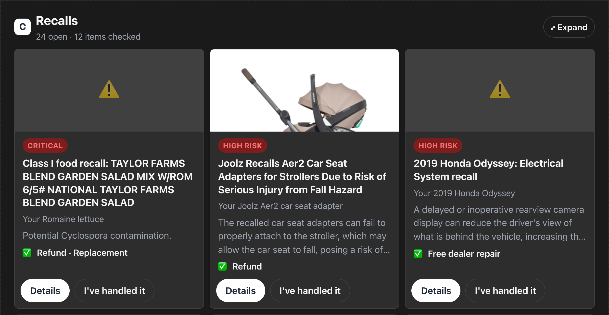
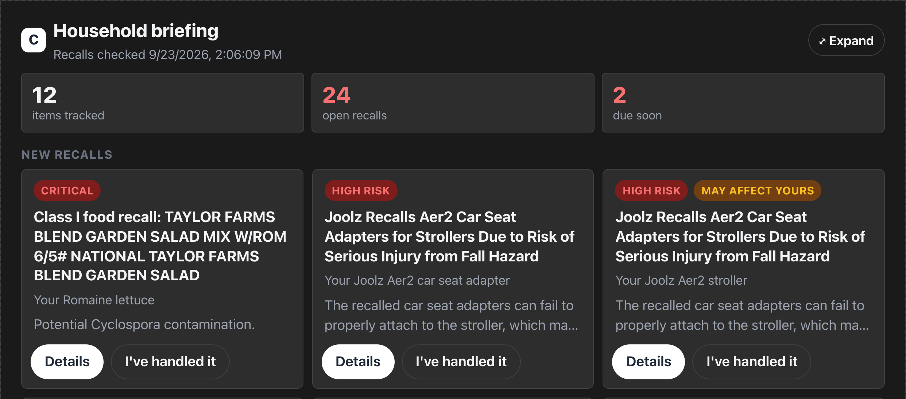
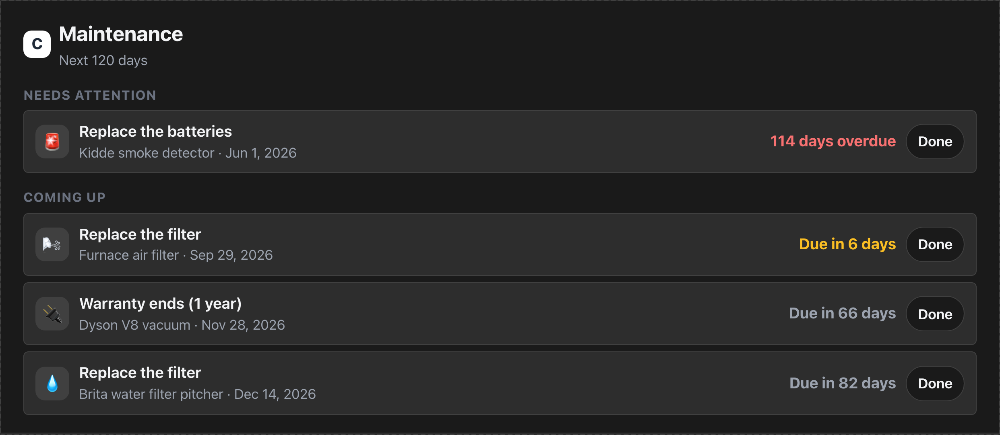
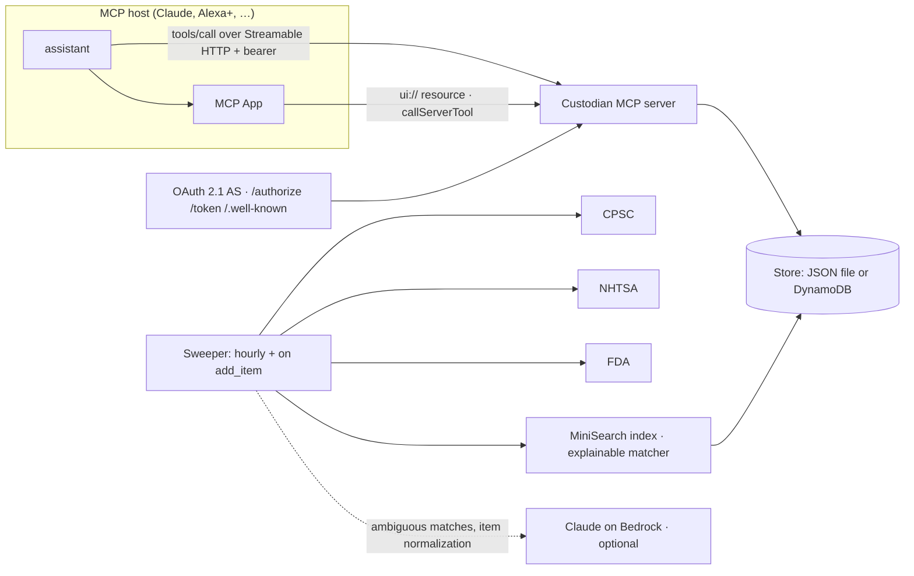

# Custodian

**A household inventory that keeps watch.**

Tell it what you own — a car seat, a stroller, the minivan, the smoke detectors — and Custodian continuously cross-references the public **CPSC**, **NHTSA** and **FDA** recall feeds, explains in plain language what is wrong and what the manufacturer will do about it, and keeps track of the small things that keep a home safe: smoke-detector batteries, water and air filters, car-seat expiry, vehicle service, warranties.

It is delivered as a **self-hosted [MCP](https://modelcontextprotocol.io) server**, so it works from any MCP host — Claude, an Echo Show running Alexa+, or a script — and it ships with an **MCP App** so hosts with a screen can show the recall notice, the affected models and a one-tap "I've handled it".

[](https://github.com/happyc0der/custodian/actions/workflows/ci.yml)


<p align="center">
  
</p>

```
"I just bought a Graco 4Ever car seat."
  → Got it, I've added Graco 4Ever car seat as a car seat. I'll keep an eye on recalls and let you know if anything comes up.

"Is anything in my house recalled?"
  → Your Joolz Aer2 car seat adapter is affected by a recall: the adapters can fail to attach to the stroller,
    which may allow the car seat to fall. The maker is offering a refund. There is one more on screen.

"Anything I should know about?"
  → Heads up: there's a new recall on your 2019 Honda Odyssey … Also, your Kidde smoke detector needs
    new batteries, 71 days overdue, and your Graco 4Ever car seat expires in 19 days.
```

**Contents:** [Why](#why-it-exists) · [What it does](#what-it-does) · [How it works](#how-it-works) · [Design notes](#design-notes) · [Running it](#running-it) · [Configuration](#configuration) · [Testing](#testing) · [Deploying](#deploying-to-aws) · [Alexa+](#alexa-integration) · [Project layout](#project-layout) · [Limitations](#limitations-and-known-gaps) · [Data sources](#data-sources)

## Why it exists

Product recalls have a poor remedy rate, and not because people don't care: the notice arrives as an email from a brand you forgot you bought from, weeks after the fact, at an address you no longer read. Meanwhile the water filter is nine months old, the smoke-detector batteries date from last year, and the car seat expired quietly on a date printed under the cushion.

The assistant that is _in the room_ when you strap a car seat in, or change a filter, is the one that should know about these things. Custodian gives that assistant a memory of what the household owns and a background process that keeps checking it — so the answer to "is anything in my house recalled?" is one sentence, spoken, with the remedy included.

## What it does

### Tools

Custodian exposes ten MCP tools. Each is one customer intent; the model (Claude, Alexa, …) decides when to call them.

| Tool                       | You say                                                    | It does                                                                                                                 | Screen             |
| -------------------------- | ---------------------------------------------------------- | ----------------------------------------------------------------------------------------------------------------------- | ------------------ |
| `add_item`                 | "I just bought a …", "we have a 2019 Honda Odyssey"        | Records the item, infers brand/category, creates default maintenance reminders, and schedules a recall sweep for it     | —                  |
| `check_recalls`            | "is my car seat recalled?", "any recalls?"                 | Precomputed recall matches for the whole household or one item, with severity and a plain-language remedy               | recall cards       |
| `get_recall_details`       | "tell me more", "who do I call?"                           | The full notice: hazard, remedy, affected models, contact, link                                                         | detail page        |
| `acknowledge_recall`       | "I requested the refund", "we threw it out"                | Marks a match as `remedy_requested`, `disposed` or `not_affected` so it stops being reported (also a button on screen)  | —                  |
| `household_briefing`       | "anything I should know?"                                  | Everything new since the last briefing: new recall matches plus maintenance due in the next 30 days; marks recalls seen | briefing dashboard |
| `whats_due`                | "what needs doing at home?"                                | Overdue and upcoming maintenance within a horizon (default 30 days)                                                     | timeline           |
| `log_maintenance`          | "I changed the smoke detector batteries"                   | Rolls an interval reminder forward (or clears a one-off one)                                                            | —                  |
| `set_maintenance_reminder` | "remind me to descale the espresso machine every 3 months" | Adds a custom recurring or one-off reminder to an item                                                                  | —                  |
| `list_inventory`           | "what are you tracking?"                                   | Items grouped by category with per-item recall badges                                                                   | inventory          |
| `remove_item`              | "we sold the stroller"                                     | Stops tracking an item and its matches and reminders                                                                    | —                  |

Every tool returns two things: **one or two spoken sentences** in `content[0].text` (no URLs, no identifiers — the model reads this aloud) and the **full payload** in `structuredContent`, validated against a declared `outputSchema` that the MCP App consumes. Ambiguity ("remove the car seat" when there are three) is handled by returning candidates so the assistant can ask, rather than by elicitation, which not every host supports. Failures are tool-execution errors with a spoken explanation, never an empty result.

### Screens

One MCP App bundle renders five views, chosen from the calling tool: recall cards, a recall detail page, the household briefing, the maintenance timeline, and the inventory. Buttons on the screens call tools back (`acknowledge_recall`, `log_maintenance`, `get_recall_details`) and push a one-line note into the model's context ("On screen, the customer marked the recall … as remedy requested") so the next spoken turn is coherent.

<p align="center">
  
  
</p>

_Rendered with the reference [MCP Apps basic-host](https://github.com/modelcontextprotocol/ext-apps/tree/main/examples/basic-host) against live recall data._

## How it works



### The life of an item

1. **You say "I just bought a Graco 4Ever car seat."** The host calls `add_item`. The handler normalises the name, infers the brand (`Graco`) and category (`car_seat`) from keyword tables, merges into an existing item if you already own one (quantity goes up), stores it, and answers — in a few milliseconds, without touching the network.
2. **After the answer is sent**, an `onItemAdded` hook runs: default maintenance reminders are created for the category (a car seat gets an expiry six years from its manufacture date), and the sweeper does a **targeted sweep** for just this item — a CPSC product search, an NHTSA lookup if it is a vehicle, an openFDA search if it is food, medicine or a device — then scores the item against every candidate recall and writes `Match` rows. If Bedrock is enabled, the model first normalises the spoken description into a structured record (brand, model, aliases) so matching has more to work with.
3. **Every hour** the full sweep runs: it pulls new CPSC records since its cursor (one year of backfill on first run), crawls another slice of NHTSA's child-seat catalogue, refreshes per-item lookups, re-scores every item in every household, and retires open matches that no longer qualify. It never touches matches the customer has acted on.
4. **You ask "is anything recalled?"** `check_recalls` reads the precomputed matches from the store, sorts by severity then confidence, and speaks the top one with its remedy. The MCP App gets the same payload and renders the cards.

### Matching

Matching is deterministic and every match carries a written `reason`. For a durable good:

| Signal                                                        | Weight                          |
| ------------------------------------------------------------- | ------------------------------- |
| Item brand appears in the recall's keywords                   | 0.45                            |
| Item model (or a model name from the recall's product list)   | 0.35                            |
| Share of the item's distinctive words found in the recall     | up to 0.30                      |
| No brand or model agreement and weak word overlap             | capped at 0.30                  |
| Recall category incompatible with the item's                  | × 0.6                           |
| Recall published more than a year before the item was bought  | × 0.5                           |
| Vehicles: exact make + model + year against an NHTSA campaign | 1.0 (anything else is 0)        |
| Food and medication: each distinctive word in the FDA record  | 0.55 for the first, +0.25 after |

A score of **0.5** records a match ("may affect yours"); **0.8** is spoken as a definite ("is affected"). Candidates come from a [MiniSearch](https://github.com/lucaong/minisearch) index over titles, products and keywords, so a household of a few dozen items scores against a corpus of thousands of recalls in milliseconds.

Recall **keywords come from the record body** (products, description, manufacturer, UPCs), and title words count only when the body corroborates them — because the CPSC feed contains at least one record whose title belongs to a different recall (see [docs/platform-notes.md](docs/platform-notes.md)). When the optional Bedrock adjudicator is on, matches in the 0.5–0.8 band are shown to Claude with the item and the recall text; a "no" verdict drops the match, a "yes" promotes it, and the verdict is cached on the match so it is never re-asked.

### Maintenance reminders

Adding an item creates category defaults; you can add your own with `set_maintenance_reminder`.

| Category               | Default reminders                                                             |
| ---------------------- | ----------------------------------------------------------------------------- |
| Smoke / CO detector    | Replace batteries every 6 months; replace the unit 10 years after manufacture |
| Water filter           | Replace every 6 months                                                        |
| HVAC / furnace filter  | Replace every 90 days                                                         |
| Car seat               | Expires 6 years after the manufacture date                                    |
| Vehicle                | Oil change and service every 6 months                                         |
| Heater                 | Inspect yearly before the heating season                                      |
| Appliance, electronics | Warranty ends one year after purchase (when a purchase date is known)         |

Interval reminders computed from an old purchase date start from today rather than beginning life "663 days overdue". Logging a task rolls it forward by its interval; one-off reminders (expiry, warranty) are cleared.

### Authentication

Custodian includes a small OAuth 2.1 **authorization server** rather than delegating to a third party, because voice assistants need a specific shape that generic MCP auth libraries do not produce. There are two tiers of access:

| Grant                                        | Scope                        | Used for                                                           | Token                                       |
| -------------------------------------------- | ---------------------------- | ------------------------------------------------------------------ | ------------------------------------------- |
| `client_credentials` (pre-registered client) | `mcp:service`                | `initialize`, `tools/list`, health — anything not tied to a person | 1 h access token, no refresh token          |
| `authorization_code` + PKCE (S256)           | `mcp:tools`, `mcp:resources` | `tools/call`, `resources/read` on behalf of a household            | 1 h access token + rotating 180-day refresh |

The code flow shows a login page where a household picks a **name and passphrase** (created on first use, scrypt-hashed; the name becomes the household id). Access tokens are ES256 JWTs with `iss = PUBLIC_URL`, `aud = PUBLIC_URL/mcp` and `sub = <household>`; the bearer middleware maps the scope to the JSON-RPC method (`tools/call` needs `mcp:tools`) and rejects with a JSON `401`/`403` — deliberately without a `WWW-Authenticate` challenge, which some assistant clients cannot process. Discovery documents live at `/.well-known/oauth-authorization-server`, `/.well-known/oauth-protected-resource` and `/.well-known/jwks.json`. `AUTH_MODE=dev` additionally accepts a static token so local tooling can skip the flow.

### Protocol details

- Built on the MCP TypeScript SDK v2. Requests are served **statelessly** — a fresh `McpServer` per request — so both the 2025-era `initialize` handshake (`2025-03-26` through `2025-11-25`) and the 2026-07-28 envelope work from the same code.
- Tools declare `outputSchema`, behaviour `annotations` (`readOnlyHint`, `destructiveHint`, `idempotentHint`) and inline SVG `icons`.
- Screen-worthy tools carry `_meta.ui.resourceUri` pointing at a **content-hashed** `ui://custodian/app-<hash>.html` resource served with `mimeType: text/html;profile=mcp-app` and a CSP that allows images only from the recall feeds' hosts. When no bundle is built the same tools run voice-only.
- Requests with a browser `Origin` that is not the configured public host are refused with `403`.
- `/metrics.json` exposes per-tool p50/p95/max latency and error counts. Locally every tool answers in well under 10 ms.

### Storage

A `Store` interface with two implementations, both covered by the same contract tests:

- **FileStore** — an in-memory map persisted to one JSON file with debounced atomic writes. The default for development; `:memory:` for tests.
- **DynamoStore** — a single-table design (`PK`/`SK`): `H#<household>` partitions hold the household record, items, matches and reminders; a shared `RECALL` partition holds the corpus; `AUTH` rows carry a DynamoDB TTL so codes, refresh tokens and pending logins expire on their own.

## Design notes

- **Nothing slow on the voice path.** Alexa+ allows 500 ms per tool call. No tool handler performs network I/O or calls a model; all of that lives in the sweeper, hourly and immediately after `add_item` returns.
- **Speech and screen are different payloads.** `content` is what gets read aloud; `structuredContent` is what gets drawn. Neither is derived from the other at render time.
- **Explain every match.** A written reason per match beats a better black-box score when a family is deciding whether to stop using a crib.
- **Hardened against the feeds.** Normalisers are null-safe, keywords are body-corroborated, a normaliser version stamp resets the persisted corpus when the rules change, and stale open matches are retired on the next sweep.
- **Household, not user.** Inventory is shared by everyone in the home, which is how a kitchen assistant is actually used.

## Running it

Requirements: Node 22+ (24 recommended), npm 10+. No API keys — the recall feeds are public.

```bash
npm install
npm run build:ui              # builds the MCP App bundle (packages/ui/dist/app.html)
cp .env.example .env          # AUTH_MODE=dev, JSON file store
npm run dev                   # http://localhost:3001/mcp  (restarts on change)
```

Then, in another terminal:

```bash
npm run seed                  # adds a realistic inventory; real recalls appear within seconds
npm run smoke                 # a scripted, voice-shaped conversation with latency numbers
npm run oauth:conformance     # the account-linking checks against a running server
npm run check                 # typecheck · lint · format · tests · UI build (what CI runs)
```

### Connecting a host

- **Claude Desktop / claude.ai** — expose the server (`npx cloudflared tunnel --url http://localhost:3001`), set `PUBLIC_URL` to the tunnel origin and `AUTH_MODE=oauth`, and add `<tunnel>/mcp` as a custom connector. Claude walks the OAuth flow; the login page creates your household on first use.
- **MCP Apps basic-host** (renders the screens) — the reference host cannot send credentials, so run `npx tsx scripts/dev-proxy.ts`, which adds the dev bearer on the way through, then in [ext-apps/examples/basic-host](https://github.com/modelcontextprotocol/ext-apps/tree/main/examples/basic-host): `SERVERS='["http://localhost:3099/mcp"]' npm start` and open http://localhost:8080.
- **Any MCP client** — `POST /mcp` with `Authorization: Bearer dev-token` (or an OAuth access token) and standard JSON-RPC.

### HTTP endpoints

| Path                                               | Purpose                                                          |
| -------------------------------------------------- | ---------------------------------------------------------------- |
| `POST /mcp`                                        | MCP Streamable HTTP endpoint (bearer required)                   |
| `GET /healthz`, `GET /metrics.json`                | Liveness; per-tool latency                                       |
| `GET /authorize`, `POST /authorize`, `POST /token` | OAuth 2.1 authorization server                                   |
| `GET /.well-known/…`                               | Authorization-server metadata, protected-resource metadata, JWKS |
| `GET /privacy`, `GET /terms`                       | Policy pages (linked from the Alexa+ listing)                    |

## Configuration

Everything is an environment variable (`.env` is read in development).

| Variable                                             | Default                                         | Meaning                                                                           |
| ---------------------------------------------------- | ----------------------------------------------- | --------------------------------------------------------------------------------- |
| `PORT`                                               | `3001`                                          | Listen port                                                                       |
| `PUBLIC_URL`                                         | `http://localhost:3001`                         | Public origin: OAuth issuer, JWT audience (`<PUBLIC_URL>/mcp`), Origin allow-list |
| `STORE`                                              | `file`                                          | `file` or `dynamo`                                                                |
| `FILE_STORE_PATH`                                    | `./data/store.json`                             | File store location (`:memory:` for ephemeral)                                    |
| `DYNAMO_TABLE`, `AWS_REGION`                         | `custodian`, `us-west-2`                        | DynamoDB store                                                                    |
| `AUTH_MODE`                                          | `dev`                                           | `dev` also accepts `DEV_BEARER_TOKEN`; `oauth` accepts only issued tokens         |
| `DEV_BEARER_TOKEN`                                   | `dev-token`                                     | Static token for local tooling (dev mode only)                                    |
| `OAUTH_CLIENT_ID`, `OAUTH_CLIENT_SECRET`             | `alexa`, `change-me`                            | The single pre-registered confidential client                                     |
| `OAUTH_REDIRECT_URIS`                                | —                                               | Comma-separated allow-list of redirect URIs                                       |
| `JWT_PRIVATE_KEY`                                    | generated                                       | PEM ES256 key; generated and persisted in the store when unset                    |
| `SWEEP_CRON`, `SWEEP_ON_BOOT`                        | `0 * * * *`, `true`                             | Full-sweep schedule; whether to sweep at start-up                                 |
| `BEDROCK_ENABLED`, `BEDROCK_REGION`, `BEDROCK_MODEL` | `false`, `us-west-2`, `anthropic.claude-opus-5` | Optional Claude-on-Bedrock enrichment (needs AWS credentials)                     |
| `UI_DIST`                                            | `packages/ui/dist`                              | Where the built MCP App bundle is read from                                       |

## Testing

`npm test` runs the vitest suite against **recorded fixtures from the live feeds**, so it is deterministic and offline:

- source normalisers for CPSC, NHTSA (vehicles and child seats) and openFDA, including the mis-titled CPSC record
- the matcher's precision cases (true positives, near-misses, generic-word traps, purchase-date recency)
- the sweeper with fake sources: incremental pulls, sliced crawling, targeted sweeps, retiring stale matches, Bedrock adjudication with a fake client
- the OAuth server end to end: discovery shape, both grants, PKCE failure, single-use codes, refresh rotation, scope gating
- every tool through the real HTTP stack, including spoken phrasing and the latency budget
- the MCP Apps wiring (resource, CSP, `_meta.ui`) and the `Store` contract against the file store and DynamoDB (via [dynalite](https://github.com/architect/dynalite))

CI runs typecheck (including the tests), ESLint, Prettier, the suite, the UI build and a CDK synth on every push.

## Deploying to AWS

`infra/` is an AWS CDK stack: one App Runner service (built from the repo's `Dockerfile`, HTTPS out of the box), a DynamoDB table, a generated OAuth client secret in Secrets Manager, and an instance role with DynamoDB and Bedrock access.

```bash
npm run infra:deploy                                  # prints ServiceUrl, McpEndpoint, TableName, OAuthClientSecretArn
npm run infra:deploy -- -c publicUrl=https://<ServiceUrl> -c redirectUris=<comma-separated redirect URIs>
```

The second deploy pins `PUBLIC_URL` (issuer and audience) once the App Runner domain exists. The stack runs with `AUTH_MODE=oauth`, `STORE=dynamo` and `BEDROCK_ENABLED=true`. One always-on instance keeps the hourly sweep alive.

## Alexa+ integration

Custodian was designed as an Alexa+ add-on (the Alexa+ MCP Toolkit connects an MCP server to Alexa devices). The requirements that shaped it — Streamable HTTP, MCP 2025-11-25, the two-tier OAuth model, a 500 ms tool budget, and MCP Apps for Echo Show — are all met by this server; the add-on manifest and the deploy sequence are in [addon-package/](addon-package/README.md), and [docs/platform-notes.md](docs/platform-notes.md) records what was not obvious from the toolkit's documentation. Deploying the add-on itself requires an Amazon developer account and the toolkit's CLI.

## Project layout

```
packages/shared/src
  schemas.ts        zod schemas: Item, RecallRecord, Match, MaintenanceRule, Household, and every tool's output
  text.ts, dates.ts tokenising, speech helpers, calendar arithmetic
packages/server/src
  index.ts          boot: config → store → auth runtime → sweeper → HTTP
  http/app.ts       Express app, /mcp handler, origin guard
  auth/             OAuth 2.1 AS (oauth.ts), bearer middleware, JWT keys, login/policy pages
  mcp/              McpServer factory, defineTool wrapper, tool implementations (tools/*.ts), views, icons
  sources/          CPSC, NHTSA vehicle, NHTSA child seat, openFDA normalisers
  match/            MiniSearch index and the scoring function
  jobs/sweep.ts     the background sweeper
  maintenance/      default reminder rules and scheduling
  enrich/           category/brand inference; optional Bedrock enricher
  store/            Store interface, FileStore, DynamoStore
  ui.ts             loads the built MCP App bundle
packages/server/test tests + recorded fixtures
packages/ui/src     Preact MCP App: host bridge, views, styles
infra               CDK stack (App Runner, DynamoDB, Secrets Manager, Bedrock IAM)
scripts             smoke, oauth-conformance, seed, gen-assets, dev-proxy, setup.sh
addon-package       Alexa+ add-on manifest and deploy notes
docs                platform notes, screenshots
```

## Limitations and known gaps

- **No proactive notifications.** The sweeper finds new recalls in the background, but you hear about them on your next briefing; MCP has no channel for a server to start a conversation.
- **Household names are a global namespace.** Two homes that pick the same name share a login (protected by the passphrase). A real deployment would link to an identity provider.
- **Single-instance sweeper.** The hourly job runs in the web process; scaling out would need a lock or a separate worker.
- **US recall feeds only**, and matching is tuned for English product names.
- Recall data can be delayed, incomplete or wrong at the source. Custodian is a prompt to check, not a substitute for the manufacturer's notice.

## Data sources

Public, keyless, and attributed on every match: [CPSC recalls](https://www.saferproducts.gov/RestWebServices/Recall?format=json), [NHTSA recalls](https://api.nhtsa.gov/) (vehicle campaigns and the child-seat catalogue), and [openFDA enforcement reports](https://open.fda.gov/apis/) for food, drugs and devices. Always confirm with the manufacturer or the issuing agency before acting.
