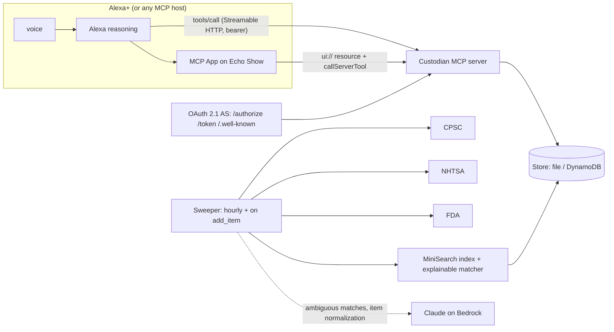

# Custodian

**A household inventory that keeps watch — for Alexa+.**

Tell Alexa what you own. Custodian cross-references it against the CPSC, NHTSA and FDA recall feeds continuously, tracks the small things that keep a home safe (smoke-detector batteries, water and air filters, car-seat expiry, vehicle service, warranties), and answers *"Alexa, is anything in my house recalled?"* hands-free — with the recall notice, the affected models and the remedy on an Echo Show.

> Built for the Alexa+ track of Amazon's **Build, Ship, Shape** hackathon (2026) as a self-hosted MCP server:
> MCP **2025-11-25** over Streamable HTTP, OAuth 2.1 in the exact two-tier shape Alexa+ account linking requires, and **MCP Apps** for the screen.
> Mini-challenges: **AWS Builder** (Bedrock enrichment, App Runner, DynamoDB) and **Open Source** (MIT, built in the open — see the commit history).

```
"Alexa, I just bought a Graco 4Ever car seat."
    → "Got it, I've added Graco 4Ever car seat as a car seat. I'll keep an eye on recalls and let you know if anything comes up."

"Alexa, is anything in my house recalled?"
    → "Your Joolz Aer2 car seat adapter is affected by a recall: the adapters can fail to attach to the stroller,
       which may allow the car seat to fall. The maker is offering a refund. There is one more on screen."

"Alexa, anything I should know about?"
    → "Heads up: there's a new recall on your 2019 Honda Odyssey … Also, replace the batteries for your Kidde
       smoke detector is 71 days overdue."
```

## Why this exists

Recalls have a famously bad remedy rate — the notice is an email from a brand you forgot you bought from, sent to an address you no longer read. The device that *is* in the room when you're strapping a car seat in, or changing a filter, is the one that should know. Alexa+ is shared by the whole household, hands-free, and now speaks MCP — so Custodian is a plain MCP server that any MCP host can use, and an Alexa+ add-on that puts it in the kitchen.

## What's in the box

| Tool | Say | Does |
|---|---|---|
| `add_item` | "I just bought a …", "we have a 2019 Honda Odyssey" | Records the item, infers brand/category, kicks off a targeted recall sweep *after* answering |
| `check_recalls` | "is my car seat recalled?", "any recalls?" | Precomputed recall matches with severity and plain-language remedy · **screen: recall cards** |
| `get_recall_details` | "tell me more", "who do I call?" | Full notice, affected models, contact · **screen: detail view** |
| `acknowledge_recall` | "I requested the refund" | Closes the match (also a button on screen) |
| `household_briefing` | "anything I should know?" | New recalls + due maintenance since last time · **screen: briefing** |
| `whats_due` | "what needs doing at home?" | Overdue / upcoming maintenance · **screen: timeline** |
| `log_maintenance` | "I changed the smoke detector batteries" | Rolls the reminder forward |
| `set_maintenance_reminder` | "remind me to descale the espresso machine every 3 months" | Custom reminders |
| `list_inventory` / `remove_item` | "what are you tracking?", "we sold the stroller" | Inventory management · **screen: inventory** |

Every tool returns one or two spoken sentences in `content[0].text` (no URLs, no ids) and the full payload in `structuredContent` with a declared `outputSchema`. Icons (SEP-973) and behaviour annotations on every tool.

### Recall sources (public, no API keys)

- **CPSC** consumer products — incremental feed into a shared index, plus a targeted product search when an item is added
- **NHTSA** vehicle campaigns by make/model/year, and the child-seat catalogue (crawled in slices, folded into one record per campaign)
- **openFDA** food, drug and device enforcement reports

Matching is deterministic and explainable (brand, model, descriptive-word overlap, category gate, vehicle exactness, purchase-date recency) with an optional Claude-on-Bedrock adjudication for the ambiguous band. Every match carries a `reason`.

## Architecture



**The 500 ms rule.** Alexa+ budgets 500 ms per tool call, so no tool handler ever touches the network or a model. All I/O happens in the sweeper — hourly, and immediately after `add_item` returns. Tools read the store; locally they answer in single-digit milliseconds (`/metrics.json` reports p50/p95 per tool).

**Auth, the Alexa way.** Alexa+ needs a two-tier OAuth model: `client_credentials` for service-level calls (`initialize`, `tools/list`), `authorization_code` + PKCE S256 bound to a household for `tools/call`, rotating refresh tokens, no dynamic registration, a `resource` parameter, multiple region-specific redirect URIs, and *no* `WWW-Authenticate` on 401. Generic MCP OAuth libraries don't emit that shape, so Custodian ships a small self-hosted authorization server (`packages/server/src/auth/`) and a conformance script that checks every one of those properties.

**Screen.** One content-hashed MCP App bundle (`ui://custodian/app-<hash>.html`, Preact, ~70 KB gzipped) renders five views chosen from the calling tool. It follows the Alexa+ MCP design guide: card/list patterns, ≥48 px touch targets, host theme + style variables, safe-area insets, a single breakpoint class from the container size, inline and fullscreen modes, and a CSP that allows only the recall feeds' image hosts. Buttons call tools (`acknowledge_recall`, `log_maintenance`, `get_recall_details`) and push what the customer did into the model's context so the next voice turn is coherent.

## Repository layout

```
packages/shared    zod schemas shared by server and UI (entities + tool output schemas)
packages/server    MCP server, OAuth 2.1 AS, recall sources, matcher, sweeper, stores
packages/ui        MCP App (Preact) → dist/app.html
infra              AWS CDK: App Runner + DynamoDB + Secrets Manager + Bedrock IAM
scripts            smoke, oauth-conformance, seed, gen-assets, dev-proxy, setup.sh
addon-package      Alexa+ add-on manifest (addon.json)
FRICTION_LOG.md    developer-experience notes kept during the build
```

## Run it locally (no Alexa account needed)

```bash
npm install
npm run build:ui              # builds the MCP App bundle
cp .env.example .env          # AUTH_MODE=dev, file store
npm run dev                   # http://localhost:3001/mcp
```

```bash
npm run seed                  # adds a realistic inventory; real recalls appear within seconds
npm run smoke                 # scripted voice-shaped conversation + latency report
npm test                      # 78 tests: sources (recorded fixtures), matcher, sweeper, OAuth, tools, stores
npm run oauth:conformance     # Alexa+ account-linking checks against a running server
```

### Try it in an MCP host

- **Claude Desktop / claude.ai**: `npx cloudflared tunnel --url http://localhost:3001`, then add the tunnel URL + `/mcp` as a custom connector (it will walk the OAuth flow; the login page creates your household).
- **ext-apps basic-host** (renders the screen views): `npx tsx scripts/dev-proxy.ts` then `SERVERS='["http://localhost:3099/mcp"]' npm start` inside `ext-apps/examples/basic-host`.
- **Alexa+ Local Inspector**: `addon-local-inspector https://<tunnel>/mcp` (needs the CodeArtifact-hosted `@alexa-ai/*` tooling — see `scripts/setup.sh`).

## Deploy to AWS

```bash
npm run infra:deploy                                  # App Runner + DynamoDB + secret; prints ServiceUrl
npm run infra:deploy -- -c publicUrl=https://<ServiceUrl> -c redirectUris=<alexa redirect uris, comma-separated>
```

The second deploy pins `PUBLIC_URL` (the OAuth issuer / JWT audience) once the App Runner domain is known. `OAuthClientSecretArn` holds the client secret you give `alexa-ai configure-account-linking`. Bedrock enrichment is on in production (`BEDROCK_ENABLED=true`, `anthropic.claude-opus-5` via the Messages-API endpoint) and off locally by default.

## Alexa+ integration

See [`addon-package/README.md`](addon-package/README.md) for the `alexa-ai new mcp → configure-account-linking → deploy → inspect → submit` sequence and the manifest.

## Design notes

- **Disambiguation by tool design, not elicitation.** Alexa's client documents `tools/call` and MCP Apps only, so ambiguous requests return candidates and let Alexa ask.
- **Voice-first outputs.** Speech never contains URLs, ids or tables; the screen carries them.
- **Explainable matches.** Deterministic scoring with a written reason per match; the model only adjudicates the 0.5–0.8 band and its verdict is cached on the match.
- **Data quality is real.** CPSC has published a record whose title belongs to another recall; NHTSA's child-seat rows can be null. Keywords come from the record body and normalizers are null-safe — details in the friction log.

## License

MIT
